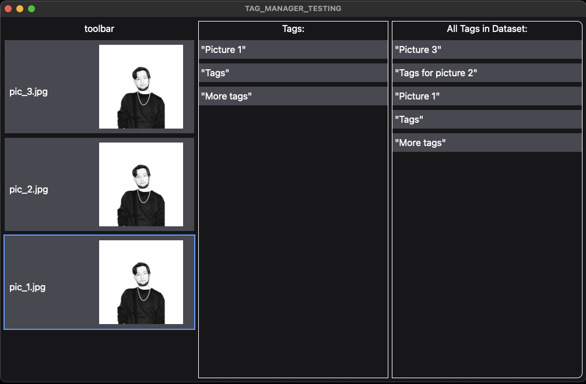

# Dataset Tag Manager (Rust)

This is a simple, cross-platform application designed to manage dataset tags. It's built with a Rust backend, powered by [Tauri](https://tauri.app/), and a user interface powered by [SvelteKit](https://kit.svelte.dev/) and [TailwindCSS](https://tailwindcss.com/).

## Features

- Cross-platform support (Windows, macOS, Linux)
- Efficient tag management for datasets
- User-friendly interface
- Lightweight and fast

## Installation

To install the Dataset Tag Manager, you will need to have Rust and Node.js installed on your machine. Follow these steps:

1. Clone the repository: `git clone https://github.com/danglebary/dataset-tag-manager-rust.git`
2. Navigate into the project directory: `cd dataset-tag-manager`
3. Install dependencies: `npm install`
4. Start the application: `npm run dev:tauri`

## Development

For development purposes, you can run the application in development mode with `npm run dev:tauri`. This will start the Tauri application and the SvelteKit application in development mode.
If you wish to run the SvelteKit application on it's own, you can run `npm run dev`. Note that the Tauri application will need to be running for any of the main functionality to work.

## Contributing

We welcome contributions! If you would like to contribute, please open an issue or a pull request.

## License

This project is licensed under the MIT License.

More docs to come... 💜